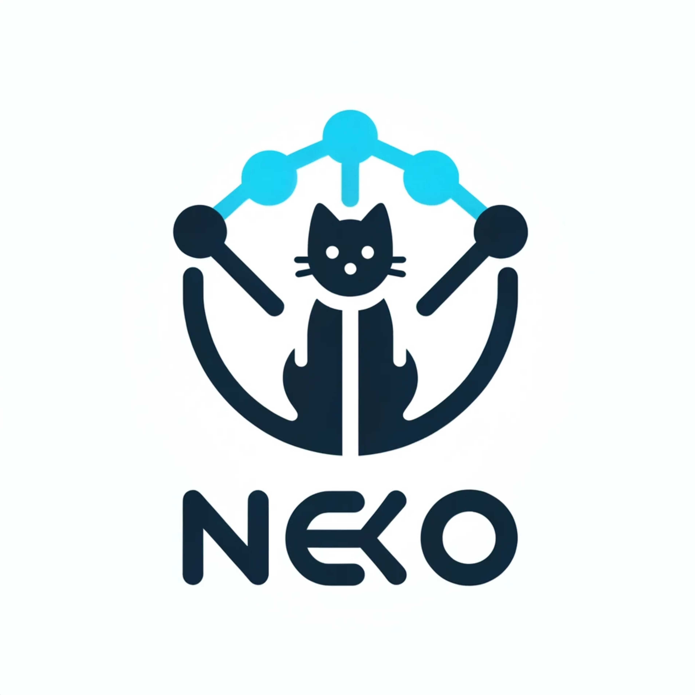

=========================
NeKo: Network Konstructor
=========================

.. image:: https://github.com/sysbio-curie/Neko/actions/workflows/build.yaml/badge.svg
   :target: https://github.com/sysbio-curie/Neko/actions/workflows/build.yaml
   :alt: Tests

.. image:: https://img.shields.io/badge/docs-MkDocs-brightgreen.svg
   :target: https://sysbio-curie.github.io/Neko/
   :alt: MkDocs Documentation

.. image:: https://img.shields.io/badge/docs-Sphinx-blue.svg
   :target: https://sysbio-curie.github.io/Neko/sphinx/
   :alt: Sphinx Documentation

Neko is a Python package for extracting, visualizing, converting, and studying interactions from databases into executable activity flow-based models. It integrates `OmniPath <https://github.com/saezlab/omnipath>`_ and other interaction resources, uses UniProt tables for identifier translation, and exports networks for tools such as `Atopo <https://github.com/druglogics/atopo>`_.

Citation
--------

If you use NeKo in your research, please cite our paper:

Ruscone M, Tsirvouli E, Checcoli A, Turei D, Barillot E, et al. (2025) NeKo: A tool for automatic network construction from prior knowledge. *PLOS Computational Biology* 21(9): e1013300. https://doi.org/10.1371/journal.pcbi.1013300

Features
--------

- Network creation and manipulation
- Connection of nodes and subnetworks
- Gene-to-phenotype mapping
- Network visualization and export helpers
- Interaction database integration
- Branching network history with automatic snapshots, HTML/SVG rendering, and state pruning controls

Connection strategies and topology
----------------------------------

NeKo connection methods answer different biological and topological questions.
Choose a strategy according to the intended flow of information rather than
only according to runtime.

The `diagram-based strategy guide
<docs_mkdocs/strategies/index.md>`_ illustrates every public connection
strategy with fictitious nodes and includes a research-question decision
table.

.. list-table:: Public connection strategies
   :header-rows: 1
   :widths: 16 22 15 24 23

   * - Strategy
     - Topological objective
     - Direction handling
     - Biological use
     - Main caveat
   * - ``connect_nodes``
     - Induced subgraph on the current nodes; no bridge nodes.
     - Every available resource direction.
     - Complete known cross-talk in a chosen node set.
     - Can mix biological contexts and densify around well-studied nodes.
   * - ``complete_connection``
     - Greedy completion of every original seed pair.
     - Attempts both directed orientations.
     - Exploratory, direction-agnostic network construction.
     - Path reuse, pair order, hubs, and literature coverage influence the result.
   * - ``connect_subgroup``
     - Pairwise completion inside one selected subset.
     - Searches both orientations.
     - Enrich one module without treating every network node as a seed.
     - Bounded path enumeration can grow rapidly.
   * - ``connect_component``
     - Join component A to component B.
     - Explicit ``IN``, ``OUT``, or ``ALL``.
     - Connect modules with a stated causal orientation.
     - ``ALL`` and follow-up subgroup connections can add substantial topology.
   * - ``connect_to_upstream_nodes``
     - Add ranked upstream regulatory cascades.
     - Upstream toward selected targets.
     - Propose regulators and upstream context.
     - Database degree and rank selection can dominate relevance.
   * - ``connect_network_radially``
     - Expand neighbor layers around the initial nodes.
     - ``IN``, ``OUT``, or both.
     - Explore local regulatory surroundings.
     - The frontier can expand quickly through hubs.
   * - ``connect_as_atopo``
     - Build a topology for Atopo-style downstream processing and outputs.
     - Inherits its radial/complete seed strategy and upstream output flow.
     - Construct output-constrained executable networks.
     - Inherits the topology and cost of delegated strategies.
   * - ``connect_genes_to_phenotype``
     - Link the network to GO-associated genes, optionally compressed.
     - Network to phenotype-associated genes through component ``OUT`` mode.
     - Connect mechanisms to a GO process or phenotype.
     - GO scope, descendants, evidence filtering, and compression change interpretation.

``complete_connection`` separates path selection from reuse of topology already
constructed during the same call:

.. list-table:: Complete-connection path and reuse combinations
   :header-rows: 1
   :widths: 16 27 28 29

   * - Path policy
     - ``reuse_policy="none"``
     - ``reuse_policy="discovered_paths"``
     - ``reuse_policy="induced_subgraph"``
   * - ``one_shortest``
     - Select one shortest path for every independently missing direction.
     - Reuse an earlier selected path before searching again.
     - Close the selected-node subgraph online and reuse emergent cross-links.
   * - ``all_shortest``
     - Select the edge union of all shortest alternatives for every independently missing direction.
     - Reuse the shortest-path union for later pairs.
     - Close that union online; typically broader than one-path selection but still bounded.
   * - ``all_bounded``
     - Select every simple path through ``maxlen`` for every independently missing direction.
     - Skip later searches already satisfied by the bounded-path union.
     - Combine bounded paths with online induced closure; potentially the densest and most expensive mode.

``maxlen`` is a mandatory positive edge cutoff for the new policies. For
shortest-path policies it limits the search but does not request a longer path:
if a two-edge path exists and ``maxlen=5``, NeKo selects the two-edge shortest
path or paths. ``all_bounded`` can be combinatorial as the cutoff grows.

The recommended explicit syntax is:

.. code-block:: python

    net.complete_connection(
        maxlen=2,
        path_policy="all_shortest",
        reuse_policy="induced_subgraph",
        only_signed=True,
        consensus=False,
    )

The former ``algorithm``, ``minimal``, and ``connect_with_bias`` arguments are
temporarily supported with a migration warning. ``algorithm="bfs"`` maps to
``one_shortest``; ``algorithm="dfs"`` maps to ``all_bounded``;
``minimal=True`` maps to ``discovered_paths``; ``minimal=False`` with bias
disabled maps to ``none``; and either ``connect_with_bias=True`` combination
maps to ``induced_subgraph``. When no old or new selector is supplied, the
transition release preserves the former effective default as
``all_bounded + discovered_paths`` without emitting a warning. Deterministic
unweighted selection improves reproducibility but is not a biological
ranking. Externally derived edge weights are planned for NeKo 2.0.

SIGNOR entity normalization
---------------------------

The built-in ``signor()`` input loads SIGNOR's human interaction table and its
complex, protein-family, phenotype, and stimulus dictionaries from NeKo's
validated local cache. Missing resources are downloaded once and added to the
cache. Proprietary endpoint IDs are normalized before the ``Universe`` is
built: complexes use the same ``COMPLEX:`` member syntax as OmniPath, while
the other group/context nodes use readable ``PROTEIN_FAMILY:``,
``PHENOTYPE:``, and ``STIMULUS:`` identifiers.

.. code-block:: python

    from neko.inputs import signor

    resources = signor()

After one successful load, the cached release can be used offline. Set
``NEKO_CACHE_DIR`` to choose the cache root. Preloaded dictionary DataFrames
can still be passed through ``entity_dictionaries``. Normalization can be
explicitly disabled with ``normalize_entities=False`` when the raw SIGNOR
identifiers are required.

SIGNOR ChEBI accessions remain canonical network identifiers and are never
sent to UniProt for translation. When a resource contains ChEBI nodes, NeKo
lazily downloads the official compressed ``compounds.tsv.gz`` table once and
caches only the names needed by that resource for display. If the download is
unavailable, network construction continues with the ChEBI accession as its
label. ChEBI data are provided by EMBL-EBI under the `Creative Commons
Attribution 4.0 International license
<https://www.ebi.ac.uk/chebi/aboutChebiForward.do>`_.

Installation
------------

NeKo is distributed as Beta software. Install the ``nekomata`` distribution
from PyPI; the Python import package remains ``neko``.

1. **Install NeKo from PyPI**:

   Do not confuse ``nekomata`` with the unrelated ``neko`` or ``pyneko``
   distributions.

   .. code-block:: bash

       python -m pip install nekomata

Installation from Source
------------------------

For the latest development version, you can still clone the repository and install directly from the source:

.. code-block:: bash

    git clone https://github.com/sysbio-curie/Neko.git
    cd Neko
    pip install .

This will give you the latest version of `NeKo` (not officially released, so be aware there could be some bugs) along with the necessary external dependencies.

Troubleshooting
---------------

If Graphviz-related installation or rendering fails, install Graphviz using
your system package manager.

.. code-block:: bash

    sudo apt-get install python3-dev graphviz libgraphviz-dev

On macOS:

.. code-block:: bash

    brew install graphviz

For more details visit: https://graphviz.org/download/

Documentation
-------------

For full documentation, including API reference and detailed tutorials, visit our `GitHub Pages documentation <https://sysbio-curie.github.io/Neko/>`_.
Users upgrading an existing workflow should also read the
`NeKo 1.9 migration guide <https://sysbio-curie.github.io/Neko/migration-1.9/>`_.

Jupyter Notebooks
-----------------

We provide a comprehensive set of Jupyter notebooks that offer a detailed and user-friendly explanation of the package. These notebooks cover all modules of NeKo and provide a complete overview of how to use the package:

1) Usage
2) Build network using user-defined resources
3) Stepwise connection: a focus on the INE algorithm
4) Connect to upstream components
5) Build network based on kinase-phosphosite interactions
6) Connect to downstream Gene Ontology terms
7) Map tissue expression
8) Network comparison
9) Re-creating famous pathways from SIGNOR and WIKIPATHWAYS using NeKo
10) Import and complete a network
11) Network history, branching, and visualisation

You can find these notebooks in the `notebooks` directory of the repository.

Features comparison with similar tools
--------------------------------------
Below you can find a table displaying the main features of NeKo compared to other similar tools:
`Features Table on GitHub <https://github.com/sysbio-curie/Neko/blob/main/table.md>`_.

Acknowledgements
----------------

This project is a collaborative effort between Institut Curie, NTNU, Saez lab and BSC.

Current contributors: Marco Ruscone, Eirini Tsirvouli, Andrea Checcoli, Dénes Turei, Aasmund Flobak, Emmanuel Barillot, Loredana Martignetti, Julio Saez-Rodriguez and Laurence Calzone.
