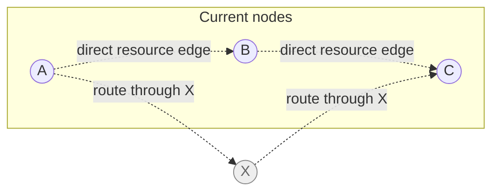
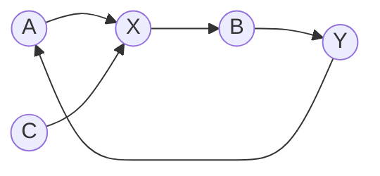
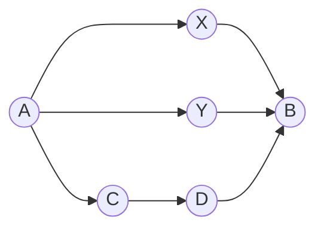
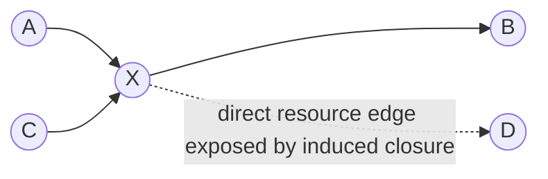
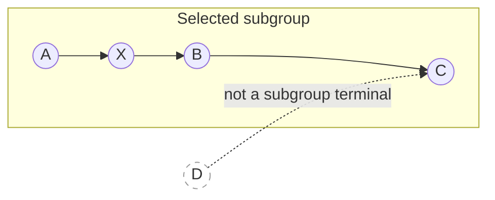
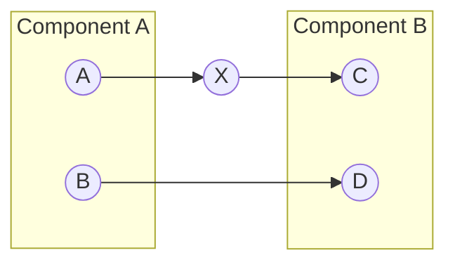
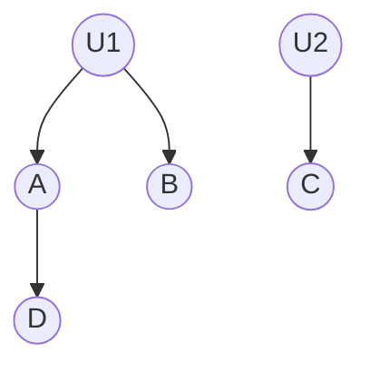
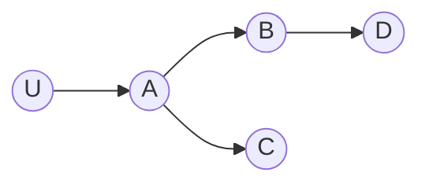
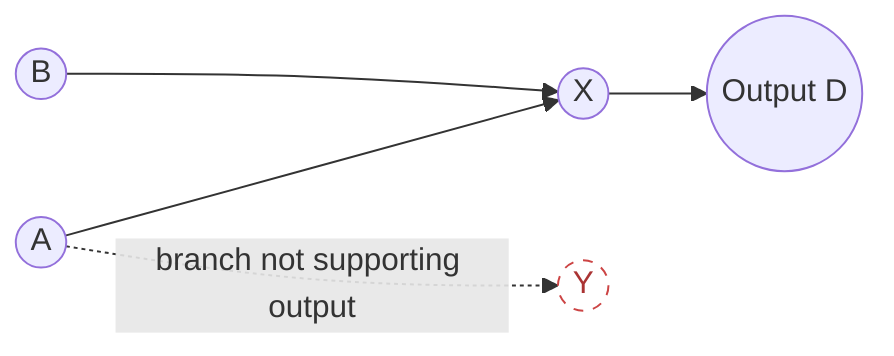
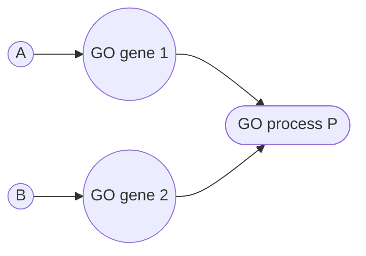

# Choosing a connection strategy

NeKo's strategies do not merely offer faster or slower ways to build the same
network. Each strategy asks a different topological question and can therefore
produce a different biological hypothesis.

The diagrams below use fictitious nodes:

- **A**, **B**, **C**, and **D** are genes supplied by the researcher.
- **X** and **Y** are bridge nodes found in the interaction resource.
- **U** is an upstream regulator.
- **P** is a phenotype or Gene Ontology node.
- Solid arrows are directed resource interactions selected into the network.
- A shaded subgraph identifies a subgroup or component supplied to a strategy.

All examples are unweighted. A shortest path is a topological result, not a
claim that the path is more biologically plausible. Context, evidence quality,
cell type, and future externally derived weights must be evaluated separately.

## Quick decision table

| Research question | Suggested strategy | Adds bridge nodes? | Direction control | Main risk |
|---|---|---:|---|---|
| Which direct interactions exist among my selected genes? | `connect_nodes` | No | Uses every available direction | Dense cross-talk from mixed contexts |
| Can every seed pair be connected in either direction? | `complete_connection` | Yes | Attempts both orientations | Pair-order, path-choice, and hub bias |
| How is one selected module internally connected? | `connect_subgroup` | Yes | Searches both orientations | Bounded path enumeration can expand rapidly |
| How can module A regulate or receive regulation from module B? | `connect_component` | Yes | `OUT`, `IN`, or `ALL` | `ALL` can produce a broad network |
| Which regulators can cover my targets? | `connect_to_upstream_nodes` | Yes | Upstream only | High-degree regulators can dominate |
| What is the local neighborhood around my seeds? | `connect_network_radially` | Yes | `OUT`, `IN`, or both | Hub-driven frontier growth |
| How do I prepare an output-oriented executable topology? | `connect_as_atopo` | Yes | Inherited from delegated strategies | Inherits their topology and cost |
| How can my mechanisms connect to a biological process? | `connect_genes_to_phenotype` | Yes | Network toward phenotype genes | GO scope and compression affect interpretation |

## `connect_nodes`: induced edges without bridges

`connect_nodes` adds every direct resource interaction whose two endpoints are
already present. It never imports **X** merely because **X** could connect two
seeds.



After `connect_nodes`, **A → B** and **B → C** are present; **X** remains
excluded.

```python
net.connect_nodes(only_signed=True, consensus_only=False)
```

Use it when the node set is already biologically curated and the goal is to
recover known direct cross-talk. With `only_signed=True`, undefined
interactions are excluded.

## `complete_connection`: greedy seed-pair completion

`complete_connection` takes the original seed nodes, visits every unordered
pair, and checks both directed orientations. When an orientation is missing in
the current working topology, it searches the resource for a bounded path.



This is the most exploratory strategy. It is appropriate when direction still
matters at the edge level, but the overall objective is to make the seed set as
complete as the resource and cutoff permit in either orientation.

### Path policy

Suppose the resource contains two two-edge routes and one three-edge route
from **A** to **B**:



| `path_policy` | Selected topology | Interpretation |
|---|---|---|
| `one_shortest` | One of `A-X-B` or `A-Y-B` | Smallest result; deterministic tie-break is not biological ranking |
| `all_shortest` | Both `A-X-B` and `A-Y-B` | Preserves every equal-length alternative without adding the longer route |
| `all_bounded` | All three routes when `maxlen >= 3` | Most complete bounded hypothesis; may be combinatorial |

`maxlen` is always a positive edge cutoff. It prevents an unexpectedly remote
route from joining genes in unrelated pathways. For shortest policies it does
not force a path to use the full cutoff.

### Reuse policy

Reuse controls which topology may satisfy a later seed-pair check:



| `reuse_policy` | What later searches can see | Topological consequence |
|---|---|---|
| `none` | Only the topology present before completion | Pair searches are independent; usually broader and less pair-order dependent |
| `discovered_paths` | Paths explicitly selected for earlier pairs | An earlier bridge can save a later resource search |
| `induced_subgraph` | Selected paths plus direct resource edges among selected nodes | Emergent cross-talk can satisfy later pairs; strongest hub and order bias |

The final network always receives one induced-edge closure over the selected
nodes. The distinction is whether that closure affects later search decisions
during construction.

```python
net.complete_connection(
    maxlen=2,
    path_policy="all_shortest",
    reuse_policy="discovered_paths",
    only_signed=True,
    consensus=False,
)
```

For a compact exploratory network, choose `one_shortest`. When equal-length
alternatives matter biologically, prefer `all_shortest`. Use `all_bounded`
only with a carefully justified cutoff.

## `connect_subgroup`: enrich one module

`connect_subgroup` searches pairwise connections only within the supplied
group. Other network nodes remain present but are not treated as subgroup
terminals.



```python
net.connect_subgroup(["A", "B", "C"], maxlen=2, only_signed=True)
```

This is useful for enriching one pathway or functional module inside a larger
network. The current implementation enumerates bounded paths and can become
expensive for large subgroups or cutoffs.

## `connect_component`: directional module-to-module bridges

`connect_component` treats two lists as components. `OUT` searches from
component A to B, `IN` searches from B to A, and `ALL` searches both.



```python
net.connect_component(
    component_a,
    component_b,
    maxlen=2,
    mode="OUT",
    only_signed=True,
)
```

Choose it when the causal relationship between modules is part of the research
question. `ALL` is not merely a more thorough `OUT`; it asks a bidirectional
question and can create substantially more topology.

## `connect_to_upstream_nodes`: ranked regulators

This strategy finds regulators that collectively cover the requested targets,
then repeats upstream for the selected depth.



```python
net.connect_to_upstream_nodes(
    nodes_to_connect=["A", "B", "C"],
    depth=2,
    rank=1,
    only_signed=True,
)
```

It is suitable for regulator discovery, but high-degree and heavily studied
regulators may rank well for technical rather than context-specific reasons.

## `connect_network_radially`: neighborhood expansion

Radial expansion adds one neighbor layer at a time around the initial seeds.
Direction controls which side of each seed is expanded.



- `direction="OUT"`, `max_len=1`: add **B** and **C**.
- `direction="IN"`, `max_len=1`: add **U**.
- `direction=None`: expand both sides.
- `max_len=2`: continue from the new frontier and potentially add **D**.

```python
net.connect_network_radially(
    max_len=1,
    direction="OUT",
    only_signed=True,
)
```

Radial expansion is local rather than pairwise. A single hub can nevertheless
produce a large frontier, so inspect node counts after every layer.

## `connect_as_atopo`: output-oriented topology

`connect_as_atopo` delegates initial construction to radial or complete
connection and can then connect designated outputs. Additions that cannot
participate in the output-oriented topology are removed.



```python
net.connect_as_atopo(
    strategy="complete",
    max_len=2,
    outputs=["D"],
    only_signed=True,
)
```

Its behavior and cost inherit the delegated strategy. Document the chosen
radial/complete semantics when reporting an Atopo-ready model.

## `connect_genes_to_phenotype`: mechanisms to a GO process

This strategy obtains genes associated with a GO accession, connects the
network toward those genes, and can compress the associated genes into one
phenotype node.



With `compress=True`, **G1** and **G2** are replaced by the canonical GO-term
node while preserving contributing interaction evidence.

```python
net.connect_genes_to_phenotype(
    id_accession="GO:0062043",
    maxlen=2,
    only_signed=True,
    compress=True,
)
```

Exact-term annotations are used by default. `include_descendants=True`, taxon
selection, evidence filtering, and compression all change the biological
scope and should be reported with the resulting network.

## Reporting checklist

For reproducible publications, record:

1. Resource name and release or file checksum.
2. Initial seed list and identifier namespace.
3. Strategy and direction mode.
4. `maxlen`/`max_len`, sign filtering, and consensus setting.
5. For completion, both path and reuse policies.
6. Whether GO descendants or phenotype compression were enabled.
7. NeKo version and any external edge-ranking or filtering procedure.
